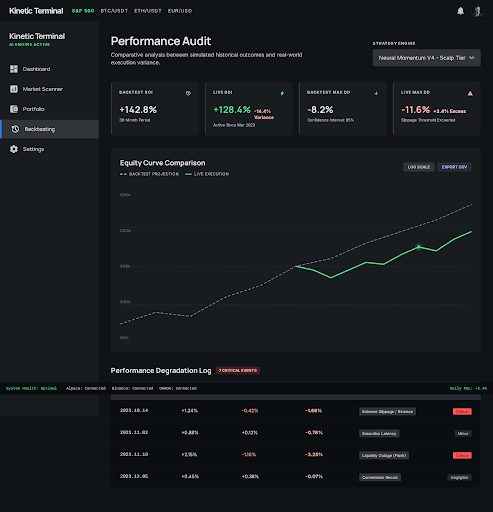
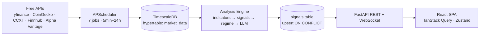

# AI Trading Bot

[](LICENSE)
[](https://www.python.org/)
[](https://nodejs.org/)
[](https://fastapi.tiangolo.com/)
[](https://react.dev/)
[](https://claude.com/claude-code)

> An AI-powered trading assistant that scans stocks, crypto, and forex markets, ranks opportunities with confidence scores and LLM reasoning, then lets you backtest and paper-trade them — before risking real money.



> **⚠️ Disclaimer:** Educational and research software. Not financial advice. Signals and backtest metrics are illustrative — they do not predict future market behavior. See [LICENSE](LICENSE) for the full disclaimer.

---

## What it does

- **Multi-market scanner** — yfinance (stocks), CoinGecko + CCXT/Binance (crypto), Alpha Vantage (forex daily), Finnhub WebSocket (live ticks)
- **Rule-based signal engine** — RSI, MACD, Bollinger Bands, ADX, ATR, EMA-50/200 confluence with regime detection (trending / ranging / volatile)
- **LLM explanations** — natural-language reasoning grounded in verified indicator values (no hallucinated numbers)
- **Backtesting** — `vectorbt`-powered, `shift(1)`-enforced (no look-ahead bias), reports Sharpe / max drawdown / win rate / profit factor
- **Paper trading** — slippage-modeled fills against live prices, equity curve, side-by-side comparison vs. backtest predictions
- **Alerts** — Telegram, Discord, and in-app on price spikes, volume surges, and trend reversals
- **Dashboard** — React 19 SPA with TradingView Lightweight Charts v5, real-time WebSocket updates, JWT-protected

## Quick start

Prerequisites: Python 3.11+, [uv](https://docs.astral.sh/uv/), Node 20+, Docker.

```bash
git clone git@github.com:justinalejandro369-star/ai-trading-bot.git
cd ai-trading-bot

# 1. TimescaleDB (PostgreSQL 16 with time-series extension)
docker compose up -d

# 2. Backend
cd backend
uv sync
cp .env.example .env                # fill in FINNHUB_API_KEY, COINGECKO_API_KEY, etc.
uv run alembic upgrade head
# generate an admin password hash and paste it into .env (ADMIN_PASSWORD_HASH):
uv run python -c "from app.core.security import hash_password; print(hash_password('your-password-here'))"
uv run uvicorn app.main:app --reload

# 3. Frontend (new terminal)
cd frontend
npm install
npm run dev                          # http://localhost:5173
```

Open `http://localhost:5173`, log in with the username/password you configured, and watch the signal feed populate as the scheduler runs.

For dev without Docker, set `DATABASE_URL=sqlite+aiosqlite:///./dev.db` in `backend/.env` to use SQLite.

## Tech stack

| Layer | Choice | Why |
|---|---|---|
| Backend | FastAPI 0.135+, SQLAlchemy 2.0 (async), Alembic, APScheduler 3.11+ | Async ASGI, type-safe, single-process scheduling without Celery overhead |
| DB | TimescaleDB (PostgreSQL 16 hypertables) — SQLite fallback for dev | Time-series queries on OHLCV stay fast as history grows |
| Data | yfinance, CoinGecko, CCXT, Alpha Vantage, Finnhub WS | All free tiers — zero data cost |
| Indicators | `pandas-ta-classic`, `pandas` | Maintained fork of `pandas-ta` |
| Backtest | `vectorbt` | Vectorized — backtests in seconds |
| LLM (optional) | OpenRouter (Claude / GPT) via LangChain | Pluggable; disabled if `OPENAI_API_KEY` empty |
| Auth | PyJWT, Argon2 (`passlib`), httpOnly cookies, `slowapi` | Single-admin login, JWT in cookie, rate-limited |
| Frontend | React 19, Vite 8, TypeScript 6, Tailwind 4, shadcn/ui | Modern SPA |
| Charts | TradingView Lightweight Charts v5, Recharts | Candlesticks + performance curves |
| State | TanStack Query 5, Zustand 5 | Server state vs UI state separation |
| E2E tests | Playwright 1.59 | Already wired |

## Architecture



**Design principle — pure functions everywhere.** `compute_indicators`, `score_signal`, `detect_regime`, `run_backtest`, `fill_order`, `check_alerts` take data in and return data out — no DB, no FastAPI, no scheduler imports. Fully testable in isolation. See `backend/CLAUDE.md` for the convention.

## Built with Claude Code

This repo is structured so that opening it in [Claude Code](https://claude.com/claude-code) gives the AI full context immediately — no `/init` required. Six tracked `CLAUDE.md` files form a layered onboarding map:

| Path | Audience |
|---|---|
| [`CLAUDE.md`](CLAUDE.md) | Root — stack, architecture, conventions, API reference |
| [`backend/CLAUDE.md`](backend/CLAUDE.md) | Backend module map + patterns for adding providers, routes, migrations |
| [`backend/app/CLAUDE.md`](backend/app/CLAUDE.md) | App-level module reference |
| [`backend/app/ingestion/CLAUDE.md`](backend/app/ingestion/CLAUDE.md) | Data provider ABC pattern, scheduler jobs, upsert semantics |
| [`backend/app/analysis/CLAUDE.md`](backend/app/analysis/CLAUDE.md) | Signal scoring, regime detection, LLM explainer |
| [`frontend/CLAUDE.md`](frontend/CLAUDE.md) | React 19 SPA, Vite proxy, Lightweight Charts v5 API |

A project-scoped subagent ships in [`.claude/agents/strategy-validator.md`](.claude/agents/strategy-validator.md). Once the pluggable strategy interface lands (see [roadmap](#roadmap)), it runs parity checks on any custom strategy you drop in.

## Add your own strategy

The "drop your algorithm into a branch and compare it to the baseline" workflow is the next milestone. See [`docs/STRATEGIES.md`](docs/STRATEGIES.md) for the interface preview and tracking issue. The high-level shape:

```bash
git checkout -b strategy/my-rsi-divergence
# create backend/app/strategies/my_rsi_divergence.py — subclass BaseStrategy
# implement generate_signal(IndicatorSet) and generate_entries_exits(df)
# register with @register_strategy decorator
PYTHONPATH=backend uv --project backend run pytest tests/test_strategies.py -v
# POST /api/backtest {"symbol": "AAPL", "strategy_name": "my_rsi_divergence"}
# Navigate to /backtest/compare in the UI — overlay vs baseline
```

Want to help design the interface? Open an issue or jump into the PR linked from [`docs/STRATEGIES.md`](docs/STRATEGIES.md).

## Roadmap

| Phase | Status | Goal |
|---|---|---|
| 1. Data Foundation | ✅ Done | Normalized OHLCV ingest for stocks + crypto |
| 2. Analysis Engine | ✅ Done | Indicators + rule-based ranked signals |
| 3. Backtesting Engine | 🚧 In progress | vectorbt + `shift(1)` look-ahead prevention |
| 4. Paper Trading | ✅ Done | Slippage-modeled fills, equity curve |
| 5. Dashboard | 🚧 In progress | Charts, signal feed, portfolio, real-time WebSocket |
| 6. Alerts & Education | 📋 Planned | Telegram/Discord, glossary, risk warnings |
| 7. LLM Explanations & Market Expansion | ✅ Done | LLM reasoning, multi-timeframe agreement, forex |
| 8. Pluggable Strategies | 📋 Next | `BaseStrategy` ABC, registry, compare UI |

Full details (success criteria, plans) in [`docs/ROADMAP.md`](docs/ROADMAP.md).

## GSD workflow (optional)

This repo was built with [Get Shit Done (GSD)](./get-shit-done/) — a spec-driven planning workflow for Claude Code. Contributors **do not need to install GSD** to work on the repo. It's available if you want phase-by-phase planning artifacts, but a regular fork → branch → PR flow is fine.

## Contributing

Read [`CONTRIBUTING.md`](CONTRIBUTING.md) for branch naming, the drop-a-strategy workflow, commit convention, and the pre-PR checklist.

## License

MIT — see [`LICENSE`](LICENSE).
