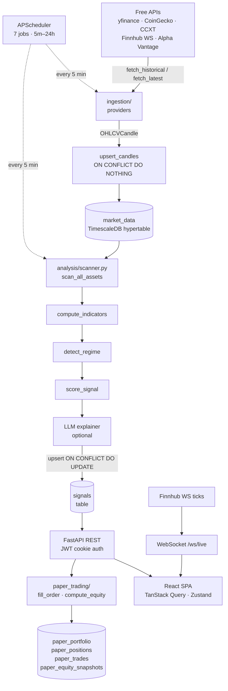

# Architecture

## High level



## Layers

### 1. Data layer — `backend/app/ingestion/`

All providers implement the `OHLCVProvider` ABC at `base_provider.py`:

```python
class OHLCVProvider(ABC):
    @abstractmethod
    async def fetch_historical(self, symbol, interval, start, end) -> list[OHLCVCandle]: ...
    @abstractmethod
    async def fetch_latest(self, symbol, interval) -> list[OHLCVCandle]: ...
```

`OHLCVCandle` is a frozen dataclass — immutable, hashable, normalized. Every provider returns the same shape regardless of upstream API quirks. The scheduler and ingestion pipeline call only the ABC, never provider-specific code. **This is the reference pattern** for adding new pluggable components (strategies, alert channels, etc.).

Providers:
- `yfinance_provider.py` — US stocks
- `finnhub_provider.py` — live WS ticks
- `coingecko_provider.py` — crypto 4H candles
- `ccxt_provider.py` — Binance OHLCV
- `forex_provider.py` — Alpha Vantage daily FX

### 2. Storage — TimescaleDB hypertable

`market_data` is a TimescaleDB hypertable partitioned by `timestamp`. Composite PK `(symbol, interval, timestamp)` plus `ON CONFLICT DO NOTHING` upsert — candles are immutable historical facts.

`signals` table uses composite PK `(symbol, interval)` (will extend to include `strategy_name` in Phase 8) and `ON CONFLICT DO UPDATE` — signals always refresh on each scan.

See `backend/CLAUDE.md` for the full schema and migration list.

### 3. Analysis — `backend/app/analysis/`

**Pure functions, no I/O.** Every function takes a DataFrame or `IndicatorSet` and returns a result. Fully testable without DB or scheduler.

- `indicators.py` — `compute_indicators(df, symbol, interval) -> IndicatorSet | None`. Requires ≥200 candles (EMA-200). Wraps `pandas-ta-classic` with exact column names (e.g. `MACD_12_26_9`, `BBP_20_2.0`).
- `signals.py` — `score_signal(ind: IndicatorSet) -> SignalResult`. Confluence rules: RSI(25pts) + MACD(30) + BB(25) + Volume(10) + EMA(10), threshold 55.
- `regime.py` — `detect_regime(ind, atr_sma_20) -> RegimeType`. ADX-based trending/ranging/volatile classification.
- `scanner.py` — `scan_asset()` orchestrates compute → regime → score → LLM → upsert. `scan_all_assets()` iterates `STOCK_WATCHLIST` + `CCXT_CRYPTO_SYMBOLS`.
- `llm_advisor.py` (optional, gated by `LLM_ENABLED`) — sends indicator context + price action to OpenRouter, expects a structured response, refuses to hallucinate values not in the input.

### 4. Backtest — `backend/app/backtesting/`

`run_backtest(df, ...) -> BacktestResult`. Uses `vectorbt` to vectorize entries/exits across the full history. Crucially applies `.shift(1).fillna(False)` so a signal generated at bar T is applied at bar T+1 — this is the look-ahead-bias prevention required by Phase 3 success criteria.

Today the entry/exit logic duplicates `score_signal()` in vectorized form. Phase 8 refactors this so both paths route through a single `BaseStrategy` implementation — one source of truth.

### 5. Paper trading — `backend/app/paper_trading/`

`fill_order()` and `compute_equity()` are pure functions. Gaussian slippage offset clipped to ±3σ, commission deducted, mark-to-market against the latest tick. Already strategy-agnostic — accepts whatever signal you feed it.

### 6. Scheduling — APScheduler

Single-process scheduler (no Celery). Seven jobs registered at app startup via the FastAPI lifespan hook:

| Job | Interval | Purpose |
|---|---|---|
| `stock_incremental` | 5m | yfinance fetch |
| `crypto_coingecko` | 30m | CoinGecko top-5 |
| `crypto_ccxt` | 15m | CCXT Binance OHLCV |
| `forex_daily` | 24h | Alpha Vantage FX |
| `analysis_scan` | 5m | Re-score all signals |
| `paper_equity_snapshot` | 5m | Mark portfolio to market |
| `alert_check` | 5m | Evaluate alert rules |

Each job runs with `max_instances=1` to prevent overlap. Errors are logged but don't crash the scheduler.

### 7. API — `backend/app/api/`

FastAPI routers, each module per resource. All protected routes depend on `get_current_user`, which decodes the JWT from the httpOnly `access_token` cookie. CORS limited to `FRONTEND_URL`. `slowapi` rate-limits sensitive endpoints. `secure` library adds HSTS, X-Frame-Options, X-Content-Type-Options, etc.

Routes documented in root `CLAUDE.md`.

### 8. WebSocket — `/ws/live`

Single broadcast channel. Finnhub WS provider pushes live ticks; the FastAPI WebSocket handler fans them out to all connected clients. Frontend `useWebSocket` hook injects ticks into TanStack Query cache so charts and signal cards update without polling.

### 9. Frontend — `frontend/`

React 19 SPA, Vite dev server proxies `/api` and `/ws` to `localhost:8000`. State split:
- **Server state** — TanStack Query (signals, candles, portfolio)
- **UI state** — Zustand stores (`theme.ts`, `chartOverlays.ts`)

shadcn/ui components in `frontend/src/components/ui/`. TradingView Lightweight Charts v5 for candlesticks; Recharts for performance curves. Playwright E2E tests in `frontend/e2e/`.

## Design principles

1. **Pure functions everywhere in analysis.** No DB or FastAPI imports in `analysis/`, `backtesting/`, `paper_trading/`. Test in isolation.
2. **ABCs for pluggable components.** `OHLCVProvider` is the canonical example. `BaseStrategy` (Phase 8) follows the same pattern.
3. **Upsert semantics.** Immutable data uses `DO NOTHING`; mutable data uses `DO UPDATE`. No row-level deletes in the hot path.
4. **`shift(1)` everywhere a signal touches future data.** Look-ahead bias is the #1 backtest killer.
5. **MIN_CANDLES = 200.** EMA-200 requires it. Scanner silently skips assets with less data — fail safe, not fail loud.
6. **Async-first.** asyncpg + SQLAlchemy 2.0 async sessions. Sync library calls (yfinance, some CCXT) wrap in `starlette.concurrency.run_in_threadpool`.

## Security model

- Single-admin login. Username + Argon2-hashed password from `.env` (`ADMIN_PASSWORD_HASH`).
- JWT (HS256) in an httpOnly cookie. `SameSite=lax` default, 30-min expiry.
- CORS restricted to `FRONTEND_URL`. `allow_credentials=True` required for cookie transport.
- Rate-limited via `slowapi` on `/auth/login` and other sensitive endpoints.
- `secure` library middleware adds the standard set of security headers asynchronously.
- Allowed methods: GET, POST, DELETE, OPTIONS.

## Where the docs live

- Root [`CLAUDE.md`](../CLAUDE.md) — full stack, API table, schema, conventions
- [`backend/CLAUDE.md`](../backend/CLAUDE.md) — backend module map + how to add providers, routes, migrations
- [`backend/app/CLAUDE.md`](../backend/app/CLAUDE.md) — app-level module reference
- [`backend/app/ingestion/CLAUDE.md`](../backend/app/ingestion/CLAUDE.md) — provider ABC details, scheduler
- [`backend/app/analysis/CLAUDE.md`](../backend/app/analysis/CLAUDE.md) — signal/indicator/regime details
- [`frontend/CLAUDE.md`](../frontend/CLAUDE.md) — Vite proxy, Lightweight Charts API, WebSocket hook
